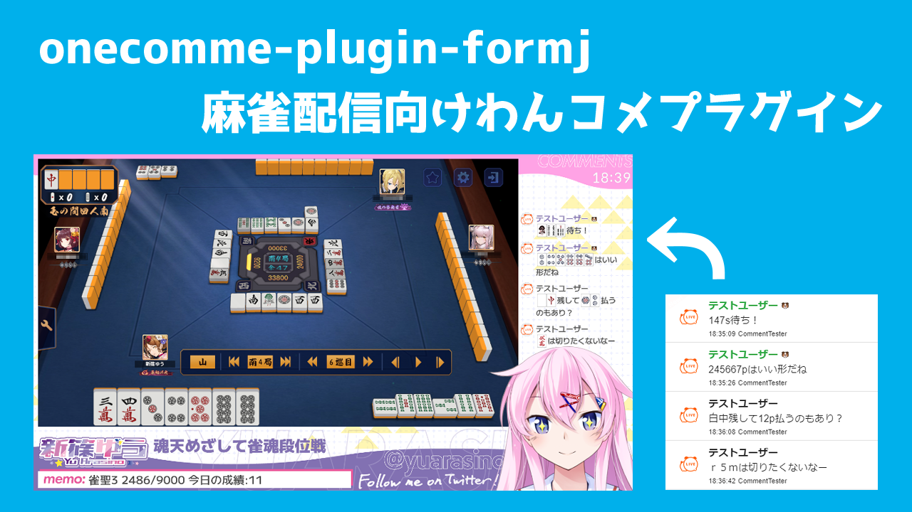

# onecomme-plugin-formj


麻雀配信向けわんコメプラグイン




## Overview

コメント欄の麻雀牌っぽいものを画像に置き換えて見やすくします！  
mpsz表記(半角・全角)と東南西北白發中の表記に対応してます


## Requirements

わんコメ v4.0+ [Download](https://onecomme.com/)


## Download

わんコメプラグイン「formj」 [formj-v1.0.0.zip](https://github.com/yuarasino/onecomme-plugin-formj/releases/download/v1.0.0/formj-v1.0.0.zip)  
プラグイン導入済みテンプレート「basic4mj」 [basic4mj-v1.0.0.zip](https://github.com/yuarasino/onecomme-plugin-formj/releases/download/v1.0.0/basic4mj-v1.0.0.zip)

## Usage: basicテンプレートへの導入方法

わんコメを使ったことがない人やbasicテンプレートを使っている人向けのformjの導入方法です  
ほかのテンプレート(yurucampなど)を使っている人は、Advancedの項目を見てください

[Usage: basicテンプレートへの導入方法](./docs/usage.md)


## Advanced: ほかのテンプレートへの導入方法

ほかのテンプレート(yurucampなど)を使っている人向けのformjの導入方法です

[Advanced: ほかのテンプレートへの導入方法](./docs/advanced.md)

## FAQ

### どの表記に対応していますか

mpsz表記(半角・全角)と東南西北白發中の表記に対応してます  
mpsz(半角)表記例: 1p、123p、112m44r5p567s44z  
mpsz(全角)表記例: １ｐ、１２３ｐ、１１２ｍ４４ｒ５ｐ５６７ｓ４４ｚ  
字牌表記例: 東、白發中  
赤ドラ表記例: 0m、r5m、赤5m、赤５ｍ

### フレンドコードなどに「1p」などが入ってしまって変換されたくない

`フレンドコード: {a1pmj}` のように `{}` で囲むと変換されなくなります

### フォントを変えたら牌がずれてしまう

OBSのカスタムCSSに以下のCSSを追加してください  
数値は使っているフォントに合わせて調整してください

```css
.tile {
  width: 30px;  /* 牌の横幅 */
  height: 42px;  /* 牌の縦幅 */
  vertical-align: -12px;  /* 牌の上下の位置 */
}
```

### 【対応検討中】採譜記号表記(一二三①②③１２３)の表記には対応していますか

今のところ対応していません  
要望が多ければ対応したいと思っています  
ただ、麻雀役の名前や配信者の名前などに漢数字があることが多く、それが全部変換されちゃうと見づらいので、どうしようかなと思ってます

### 【対応困難】「東京」「南入」などが変換されてしまう

仕様です  
真面目に対応しようとすると麻雀専用に辞書を作って形態素解析したりしないといけないので難しいです……(例えば前後に他の漢字が続かないっていうルールだと東切りとか変換されなかったり)  
ギリギリ読めるからいいやって感じで使ってもらえるとありがたいです


## Contribution

ぜひ不具合報告や改善要望をしてもらえると嬉しいです！  
GitHubのIssueかTwitterのDMまでお願いします


## Author

新篠ゆう [Twitter](https://twitter.com/yuarasino)


## License

GPL [License](./LICENSE)
