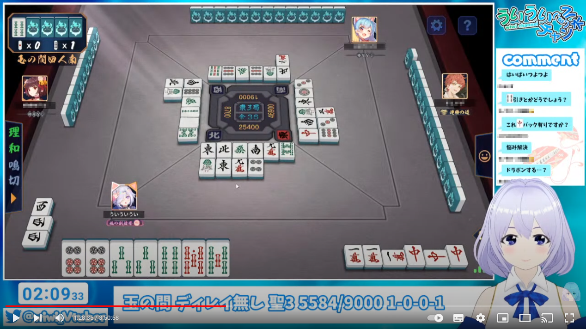

# onecomme-plugin-formj

## Overview

コメント欄の麻雀牌っぽいものを画像に置き換えて見た目を楽しくします！  
わんコメのほとんどのテンプレートに導入できます。

## Requirement

わんコメ v4.0+ [Download](https://onecomme.com/)  
**v3.xを使っている人はアップデートをお願いします。**

## Download

わんコメプラグイン「formj」  
[formj-v1.1.1.zip](https://github.com/yuarasino/onecomme-plugin-formj/releases/download/v1.1.1/formj-v1.1.1.zip)

プラグイン導入済みテンプレート「basic4mj」  
[basic4mj-v1.1.1.zip](https://github.com/yuarasino/onecomme-plugin-formj/releases/download/v1.1.1/basic4mj-v1.1.1.zip)

## Usage: 「basic4mj」テンプレートの導入方法

わんコメを使ったことがない人やbasicテンプレートを使っている人向けの「basic4mj」導入方法です。  
わんコメデフォルトの「basic」テンプレートに「formj」プラグインを導入したテンプレートで、フォルダをコピーするだけですぐに使い始めることができます。

他のテンプレート(yurucampなど)を使っている人は、[Advanced](./docs/advanced.md)の項目を見てください。

手順: [Usage: 「basic4mj」テンプレートの導入方法](./docs/usage.md)

## Advanced: 他のテンプレートへの「formj」導入方法

他のテンプレート(yurucampなど)を使っている人向けの「formj」導入方法です。

手順: [Advanced: ほかのテンプレートへの「formj」導入方法](./docs/advanced.md)

## Customize: テンプレートのカスタマイズ

導入後にテンプレートをカスタマイズしたいときの方法です。

手順: [Customize: テンプレートのカスタマイズ](./docs/customize.md)

## FAQ

### どの表記に対応していますか

mpsz表記と漢字表記と字牌表記に対応してます。 

mpsz(半角)表記例: 1m、123p、258-36s、12233m123p123s44zツモ1m、(赤ドラ: 0m、r5m、赤5m)

mpsz(全角)表記例: １ｍ、１２３ｐ、２５８－３６ｓ、１２２３３ｍ１２３ｐ１２３ｓ４４ｚツモ１ｍ、(赤ドラ: ０ｍ、ｒ５ｍ、赤５ｍ)

漢字表記例: 1萬、１２３筒、二五八－三六索、(赤ドラ: 0萬、ｒ５萬、赤五萬)

字牌表記例: 東、発、白發中

### フレンドコードなどに「1p」などが入ってしまって変換されたくない

`フレンドコード: {a1pmj}` のように `{}` で囲むと変換されなくなります。

### フォントを変えたら牌がずれてしまう

こちらに修正方法があります。

手順: [Customize: テンプレートのカスタマイズ](./docs/customize.md)

### 自分の名前に「北」や「白」が入っていて、変換してほしくない

こちらに修正方法があります。

手順: [Customize: テンプレートのカスタマイズ](./docs/customize.md)

### 【対応困難】採譜記号表記(一二三①②③１２３)には対応していますか

今のところ対応していません。  
要望が多ければ検討したいと思っています。  
ただ、麻雀役の名前や配信者の名前などに漢数字があることが多く、それが全部変換されちゃうと見づらいのでどうしようかなと思ってます。

### 【対応困難】「東京」「南入」などが変換されてしまう

仕様です。  
真面目に対応しようとすると麻雀専用に辞書を作って形態素解析したりしないといけないので難しいです……  
(例えば前後に他の漢字が続かないっていうルールだと東切りとか変換されなかったり。)  
ギリギリ読めるからいいやって感じで使ってもらえるとありがたいです。

## Contribution

ぜひ不具合報告や改善要望をしてもらえると嬉しいです！  
GitHubのIssueかTwitterのDMまでお願いします。

## Author

新篠ゆう [Twitter](https://twitter.com/yuarasino)

## License

GPL-3.0 [License](./LICENSE)

This repository contains the following third-party resources: 

- https://github.com/WarL0ckNet/tile-art licensed under GPL-3.0

## Example

  
  

