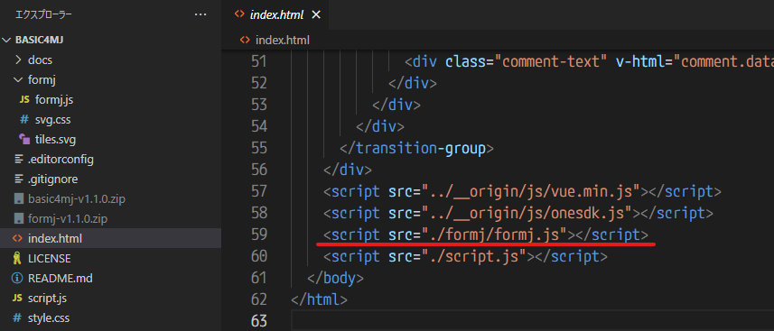

# Advanced: ほかのテンプレートへの「formj」導入方法

他のテンプレート(yurucampなど)を使っている人向けの「formj」導入方法です

## 1. テンプレートフォルダを開く

わんコメ右上の「・・・」→「フォルダを開く」を押す  
「templates」フォルダを開く


## 2. テンプレートフォルダの使いたいテンプレートをコピーして名前を変える

使いたいテンプレートを選んでコピーして、名前を変える  
例: 「yurucamp」→「yurucamp4mj」


## 3. 名前を変えたフォルダにDLしたプラグインをコピーする

以下のプラグインをDLして解凍する  
[formj-v1.1.0.zip](https://github.com/yuarasino/onecomme-plugin-formj/releases/download/v1.1.0/formj-v1.1.0.zip)

「formj-v1.1.0」フォルダの中にある **「formj」フォルダ** を名前を変えたフォルダにコピーする


## 4. index.htmlに1行追加する

`<script src="./script.js"></script>` の上に、以下の1行を足す

```html
<script src="./formj/formj.js"></script>
```



## 5. script.jsに1行追加する

`const index = cache.get(comment.data.id)` の上に、以下の1行を足す

```js
comment = comment4mj(comment)
```


## 6. テンプレートを選んでOBSにソースを追加する

以下のドキュメントを参考に、テンプレートを選んでOBSにソースを追加する  
[OBSにコメントを表示](https://onecomme.com/docs/guide/template)
