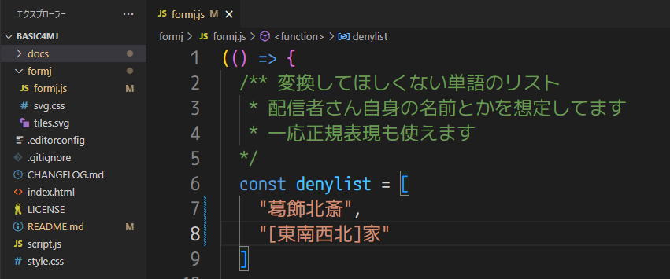

# Customize: テンプレートのカスタマイズ

## フォントや色を変えたい

[わんコメ: テンプレートエディタ](https://onecomme.com/generator/templates/4_0)がそのまま使えます。  
ベーステンプレートは「formj」を組み込んだテンプレート(「basic4mj」なら「basic」)を選択してください。

## フォントを変えたら牌がずれてしまう

OBSのカスタムCSSに以下のCSSを追加してください。  
数値は使っているフォントに合わせて調整してください。

```css
.tile {
  width: 30px;  /* 牌の横幅 */
  height: 42px;  /* 牌の縦幅 */
  vertical-align: -12px;  /* 牌の上下の位置 */
}

.margin {
  margin-right: 4px;  /* 文字と牌の間の間隔 */
}
```

## 自分の名前に「北」や「白」が入っていて、変換してほしくない

配信者さんの名前などを想定して、変換されたくない単語をあらかじめ書いておく機能があります。  

テンプレートの「formj」フォルダの中の `formj.js` ファイルをメモ帳で開く。  
ファイル先頭の `denylist` に、変換されたくない単語を書く。

```js
/** 変換してほしくない単語のリスト
  * 配信者さんの名前とかを想定してます
  * 一応正規表現も使えます
*/
const denylist = [
  "葛飾北斎",
  "[東南西北]家"
]
```



現状、「変換してほしくない単語のリスト」はアップデートのたびにコピペしてもらう必要があります。  
この辺りは今後改善したいと思ってます。
