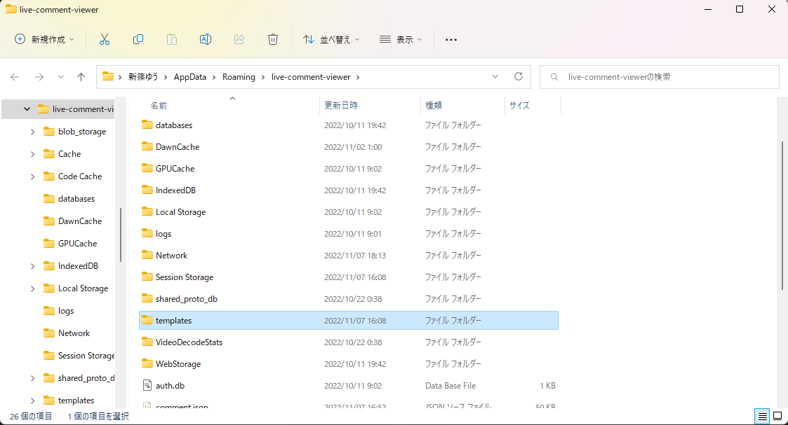

# Usage: basicテンプレートへの導入方法

わんコメを使ったことがない人やbasicテンプレートを使っている人向けのformjの導入方法です  
ほかのテンプレート(yurucampなど)を使っている人は、[Advanced](./advanced.md)の項目を見てください

## 1. テンプレートフォルダを開く

わんコメ右上の「・・・」→「フォルダを開く」を押す  
「templates」フォルダを開く

## 2. テンプレートフォルダにDLしたテンプレートをコピーする

以下のテンプレートをDLして解凍する  
[basic4mj-v1.0.0.zip](https://github.com/yuarasino/onecomme-plugin-formj/releases/download/v1.0.0/basic4mj-v1.0.0.zip)

「basic4mj」フォルダをテンプレートフォルダにコピーする  

## 3. テンプレートを選んでOBSにソースを追加する

以下のドキュメントを参考に、テンプレートを選んでOBSにソースを追加する  
[OBSにコメントを表示](https://onecomme.com/docs/guide/template)
